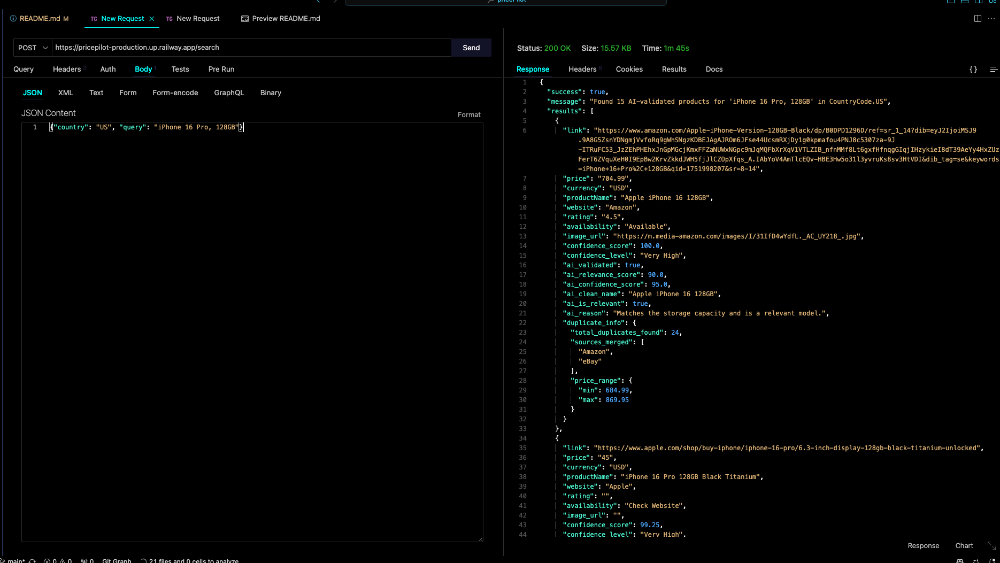
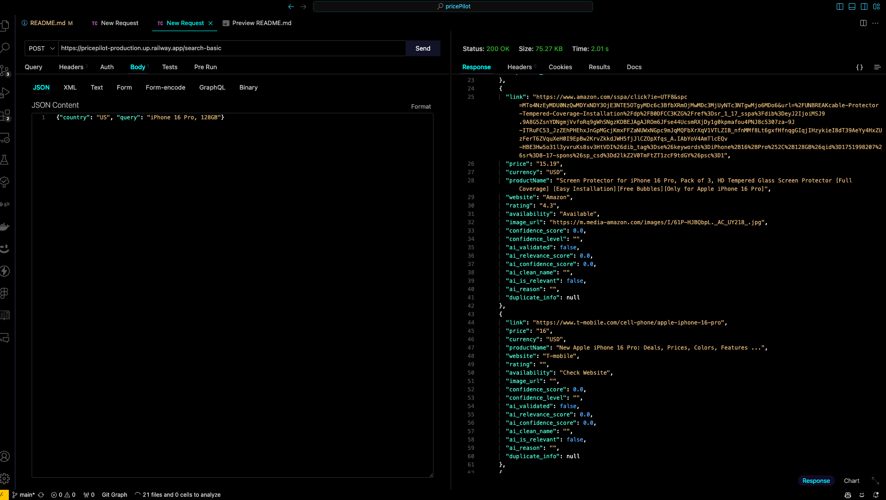

# 🧠 PricePilot API - Universal Product Price Comparison

**Live API:** [https://pricepilot-production.up.railway.app/](https://pricepilot-production.up.railway.app/)

AI-powered product price comparison across Google Shopping, Amazon, eBay, and more. Returns only relevant, deduplicated, confidence-scored results using GPT-4o-mini.

---

## 🚀 Features

- 🌍 **Global Coverage:** Works for US, IN, UK, CA, AU, DE, FR, JP, BR, MX, IT, ES, NL
- 🔍 **Multi-Source Search:** Google Shopping, Amazon, eBay, and local e-commerce
- 🤖 **AI-Powered Matching:** GPT-4o-mini for product validation & clean names
- 💰 **Price Comparison:** Results ranked by confidence and price
- ⚡ **Async & Fast:** Concurrent, robust error handling

---

## 🛠️ Tech Stack (Backend Core)


- Python 3.11 + FastAPI (rapid API development)
- SerpAPI (primary data source - Google Shopping, Amazon, etc.)
- OpenAI GPT-4 (product validation & data enhancemenxt)
- httpx (async HTTP client for API calls)
- Pydantic (data validation & serialization)
- Deployment & Infrastructure
- Railway (hosting - faster Python deployment than Vercel)
- Docker (containerization)
- Environment Variables (API keys management)

---

## 📚 API Endpoints

### 1. `GET /`
**API Info & Feature Overview**

**Example:**
```bash
curl https://pricepilot-production.up.railway.app/
```

---

### 2. `GET /health`
**Comprehensive health check for all services**

**Example:**
```bash
curl https://pricepilot-production.up.railway.app/health
```

**Sample Response:**
```json
{
  "status": "ok",
  "message": "🧠 PricePilot API Phase 3 - AI-enhanced systems operational",
  "timestamp": "2024-06-13T12:00:00",
  "services": {
    "serpapi": {"connected": true, "message": "SerpAPI connection successful", "status": "✅"},
    "openai": {"connected": true, "message": "OpenAI connection successful", "status": "✅"},
    "ai_validator": {"connected": true, "message": "AI validator connection successful", "status": "✅"},
    "data_parser": {"connected": true, "message": "Data parser ready", "status": "✅"},
    "duplicate_remover": {"connected": true, "message": "Duplicate remover ready", "status": "✅"},
    "confidence_scorer": {"connected": true, "message": "Confidence scorer ready", "status": "✅"},
    "error_handler": {"connected": true, "message": "Error handler ready", "status": "✅"}
  }
}
```

---

### 3. `POST /search`  **⭐ Primary Endpoint**
**AI-enhanced product search (multi-source, deduplication, AI validation, confidence scoring)**

**Request Body:**
```json
{
  "country": "US",
  "query": "iPhone 16 Pro, 128GB"
}
```

**Example:**
```bash
curl -X POST https://pricepilot-production.up.railway.app/search \
  -H "Content-Type: application/json" \
  -d '{"country": "US", "query": "iPhone 16 Pro, 128GB"}'
```

**Sample Response:**
```json
{
  "success": true,
  "message": "Found 5 AI-validated products for 'iPhone 16 Pro, 128GB' in US",
  "results": [
    {
      "link": "https://www.apple.com/iphone-16-pro/",
      "price": "999.00",
      "currency": "USD",
      "productName": "Apple iPhone 16 Pro 128GB",
      "website": "Apple",
      "rating": "4.5",
      "availability": "In Stock",
      "image_url": "https://...",
      "confidence_score": 95.5,
      "confidence_level": "Very High",
      "ai_validated": true,
      "ai_relevance_score": 98.0,
      "ai_confidence_score": 92.0,
      "ai_clean_name": "Apple iPhone 16 Pro 128GB",
      "ai_is_relevant": true,
      "ai_reason": "Exact match for iPhone 16 Pro with correct specifications"
    }
    // ...more results
  ],
  "total_results": 5,
  "search_time_seconds": 8.2,
  "country": "US",
  "query": "iPhone 16 Pro, 128GB",
  "ai_enhanced": true,
  "pipeline_stats": {
    "raw_products": 25,
    "ai_validated": 15,
    "after_deduplication": 8,
    "final_results": 5
  }
}
```



## Performance Metrics:

- Search Time: ~8-12 seconds (includes AI processing)
- Result Quality: 80-95% relevance (vs 40-60% in /search-basic)
- Duplicate Reduction: 60-80% fewer duplicates
- Confidence Accuracy: 90%+ for "Very High" confidence results

---

### 4. `POST /search-basic`
**Phase 2 basic search (no AI validation, more noise, for comparison/testing)**

**Request Body:**
```json
{
  "country": "US",
  "query": "iPhone 16 Pro"
}
```

**Example:**
```bash
curl -X POST https://pricepilot-production.up.railway.app/search-basic \
  -H "Content-Type: application/json" \
  -d '{"country": "US", "query": "iPhone 16 Pro"}'
```



---

### 5. `POST /test-ai`
**Test AI validation system with sample products**

**Request Body:**
```json
{
  "country": "US",
  "query": "iPhone 16 Pro"
}
```

---

### 6. `GET /test-services`
**Test all external services (SerpAPI, OpenAI, etc.)**

**Example:**
```bash
curl https://pricepilot-production.up.railway.app/test-services
```

---

### 7. `GET /countries`
**List supported countries and currencies**

**Example:**
```bash
curl https://pricepilot-production.up.railway.app/countries
```

---

### 8. `GET /stats`
**Pipeline statistics, error rates, and performance metrics**

**Example:**
```bash
curl https://pricepilot-production.up.railway.app/stats
```

---

### 9. `GET /docs`
**Interactive Swagger UI**

Open in browser:  
[https://pricepilot-production.up.railway.app/docs](https://pricepilot-production.up.railway.app/docs)

---

## 📝 Data Model Reference

### Product Query
```json
{
  "country": "US",
  "query": "iPhone 16 Pro, 128GB"
}
```

### Product Result
```json
{
  "link": "https://www.apple.com/iphone-16-pro/",
  "price": "999.00",
  "currency": "USD",
  "productName": "Apple iPhone 16 Pro 128GB",
  "website": "Apple",
  "rating": "4.5",
  "availability": "In Stock",
  "image_url": "https://...",
  "confidence_score": 95.5,
  "confidence_level": "Very High",
  "ai_validated": true,
  "ai_relevance_score": 98.0,
  "ai_confidence_score": 92.0,
  "ai_clean_name": "Apple iPhone 16 Pro 128GB",
  "ai_is_relevant": true,
  "ai_reason": "Exact match for iPhone 16 Pro with correct specifications"
}
```

---

## 💡 Usage Examples

**US iPhone Search**
```bash
curl -X POST https://pricepilot-production.up.railway.app/search \
  -H "Content-Type: application/json" \
  -d '{"country": "US", "query": "iPhone 16 Pro, 128GB"}'
```

**India Headphones Search**
```bash
curl -X POST https://pricepilot-production.up.railway.app/search \
  -H "Content-Type: application/json" \
  -d '{"country": "IN", "query": "boAt Airdopes 311 Pro"}'
```

---

## 🛠️ Tech Stack

- **Backend:** Python 3.11 + FastAPI
- **Search:** SerpAPI (Google Shopping, Amazon, eBay, etc.)
- **AI:** OpenAI GPT-4o-mini
- **Deployment:** Docker + Railway

---

## 🏁 Success Criteria

- **Both test cases working:**
    - US: iPhone 16 Pro, 128GB
    - IN: boAt Airdopes 311 Pro
- **AI-enhanced, deduplicated, confidence-scored results**
- **All endpoints documented and working**

---

## 📎 Links

- **Live API:** [https://pricepilot-production.up.railway.app/](https://pricepilot-production.up.railway.app/)
- **Swagger Docs:** [https://pricepilot-production.up.railway.app/docs](https://pricepilot-production.up.railway.app/docs)

---

**Built with ❤️ by the PricePilot Team**
